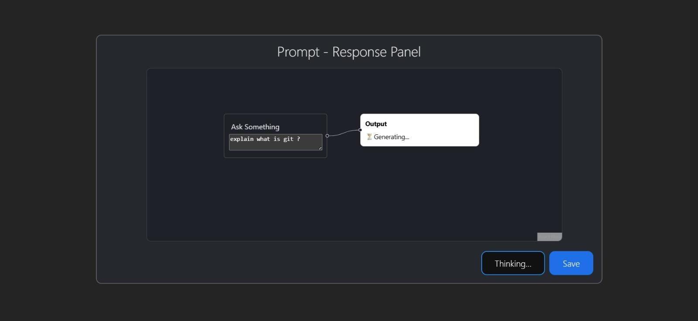
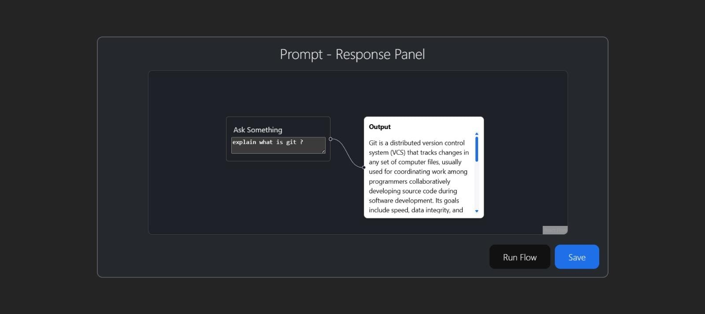
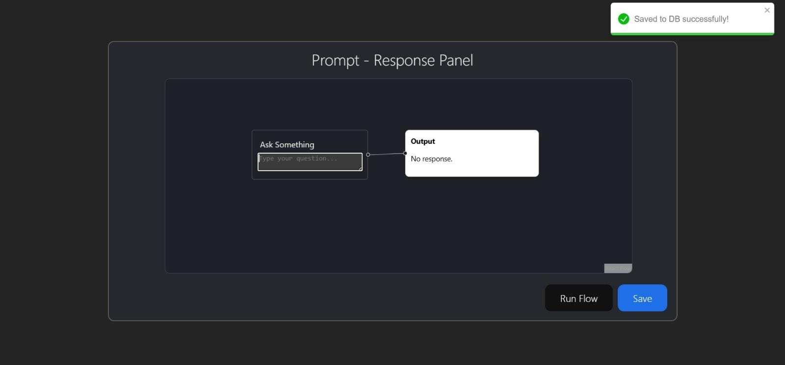

🧠 MERN AI Flow — Prompt → Response Flow App

A visual AI flow builder where users can enter a prompt, receive an AI-generated response, and optionally save it to the database — represented using a node-based UI via React Flow.

🚀 Live Demo

Frontend → https://mern-ai-flow-xi.vercel.app

Backend API → https://mern-ai-flow-c4dn.onrender.com

✨ Features

✔ Node-based UI using React Flow

✔ AI-powered response via OpenRouter API

✔ Save prompt + response to MongoDB

✔ Fully deployed (Frontend + Backend)

✔ CORS configured

✔ Environment variable support

✔ Works on Vercel + Render

🖥️ Tech Stack

Frontend

->React (Vite)

->React Flow

->React Toastify

->Hosted on Vercel
-----------------------------------------------------------------------------
Backend

->Node.js + Express

->MongoDB + Mongoose

->OpenRouter AI API

->CORS

->Hosted on Render

->Database

->MongoDB Atlas (Cloud)

📂 Folder Structure
mern-ai-flow/
 ├── client/    # React frontend
 └── server/    # Express backend
---------------------------------------------------------------------
📡 API Endpoints
POST /api/ask-ai

Request:

{ "prompt": "explain what is git?" }

POST /api/save-response

Request:

{ "prompt": "...", "response": "..." }
----------------------------------------------------------------------
🔐 Environment Variables
Frontend (.env)
VITE_API_BASE_URL=https://mern-ai-flow-c4dn.onrender.com

Backend (.env)
OPENROUTER_API_KEY=your_key
MONGO_URI=your_mongodb_uri
---------------------------------------------------------------------
🛠️ Local Development Setup

Clone the repo:

git clone https://github.com/BhavyaLuthra18/mern-ai-flow.git
cd mern-ai-flow

Run frontend:
=>cd client
=>npm install
=>npm run dev

Run backend:
cd ../server
npm install
npm run dev

-------------------------------------------------------------------------------------
🌍 Deployment Info

Service	Platform
Frontend:Vercel
Backend:Render
DB	MongoDB:Atlas

-----------------------------------------------------------------------------------
## 🎬 Demo Preview
Below is an example flow showing prompt → AI response → save action.

### 🟦 Step 1 — Enter Prompt

### 🟨 Step 2 — AI is generating response

### 🟩 Step 3 — Response ready + Save option

-----------------------------------------
## 🎥 Video Walkthrough

